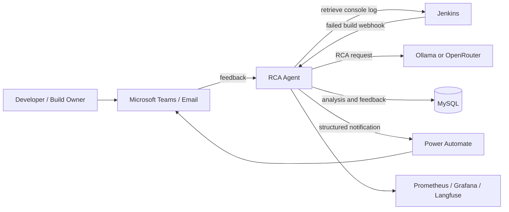
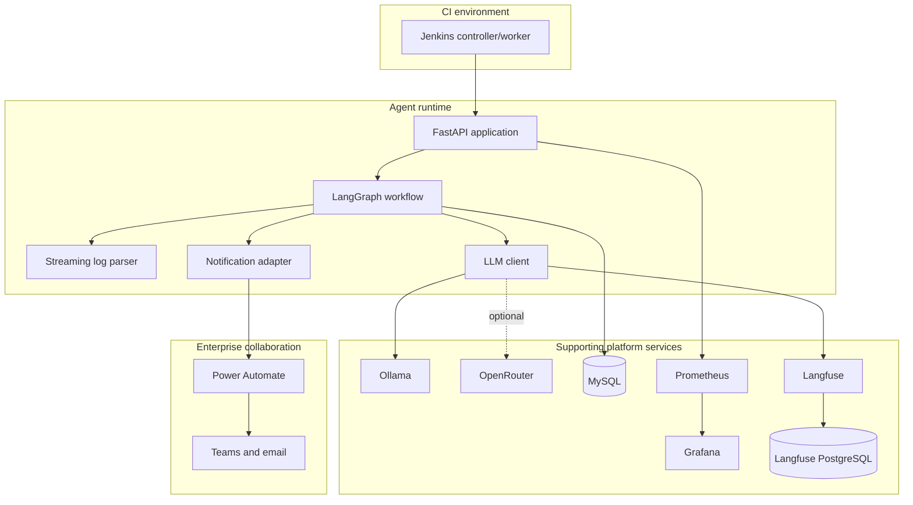
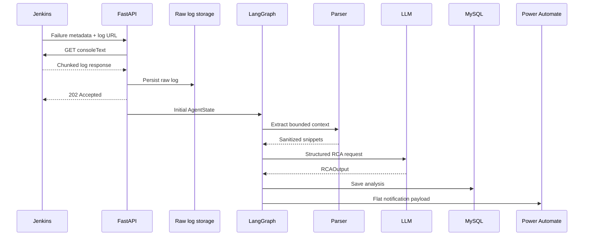
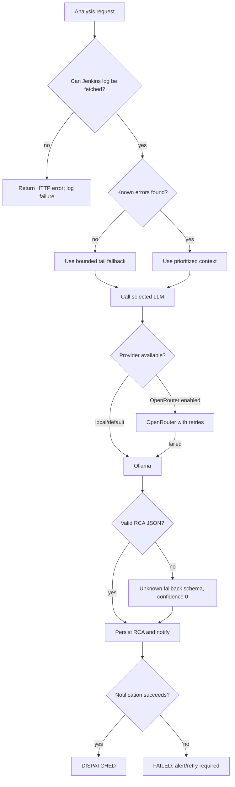
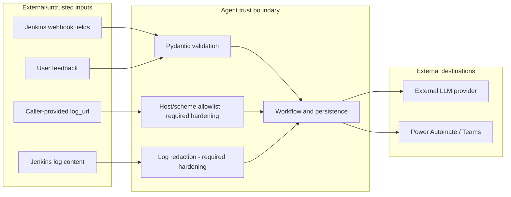
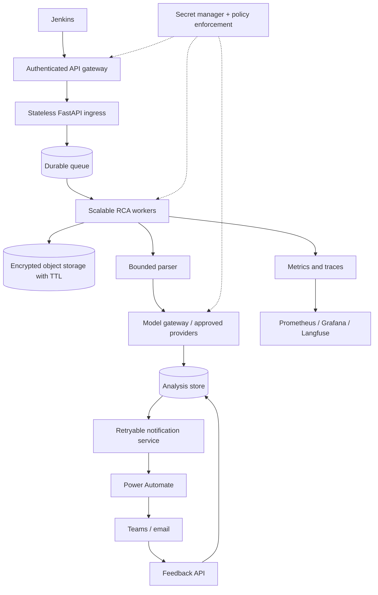

# Jenkins RCA Agent — Architecture Diagrams

This file contains presentation-ready diagrams for the Jenkins RCA Agent. The diagrams are intentionally kept in Mermaid so they can be rendered by GitHub, Mermaid Live, documentation portals, or architecture tooling that supports Mermaid.

## 1. System context

## 2. Container architecture

## 3. Data flow

## 4. Failure and fallback paths

## 5. Trust boundaries

## 6. Target production architecture

## Diagram usage notes

- Use diagrams 1 and 2 for architecture review.
- Use diagram 3 for implementation and onboarding.
- Use diagram 4 for resilience and incident reviews.
- Use diagram 5 for security threat modeling.
- Use diagram 6 as the recommended target-state roadmap, not as a claim about the current deployment.
