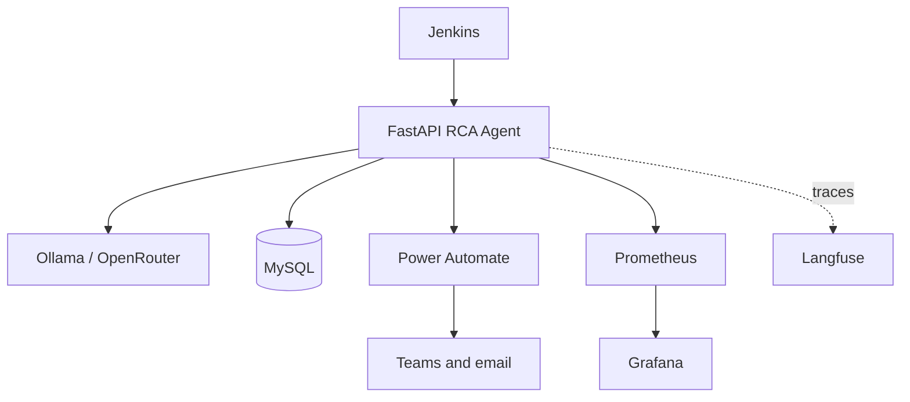
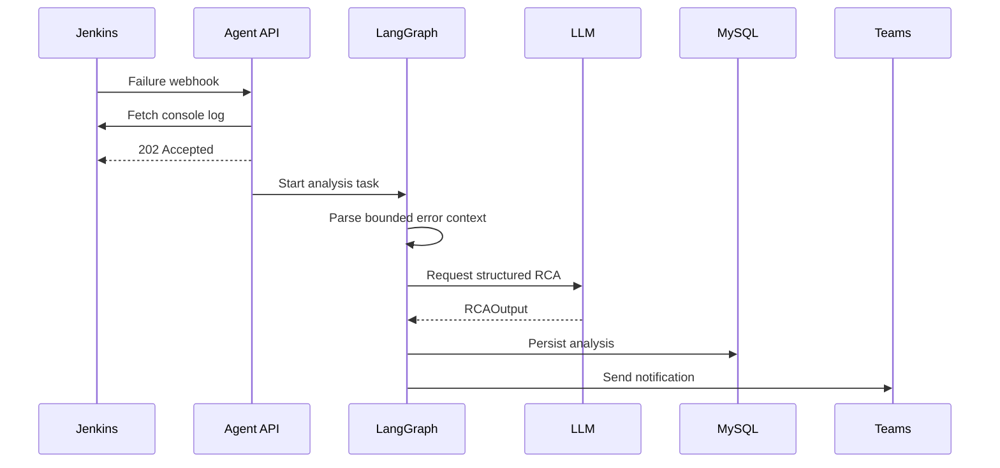
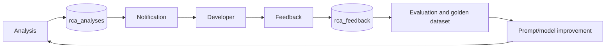

# Jenkins RCA Agent — Architecture Presentation Outline

This outline can be used to create a senior-architecture or management presentation.

## Slide 1 — Title

**Jenkins AI Root-Cause Analysis Agent**  
Automated, evidence-backed triage for failed CI builds

- Repository: `lyi1cob-ayub/jenkin-learning`
- Audience: Architecture, engineering management, platform and SRE teams

## Slide 2 — Problem statement

- Jenkins failures generate large, noisy console logs.
- Engineers spend time locating the first meaningful error.
- Infrastructure and application failures are often mixed together.
- Existing notifications usually state that a build failed, but not why or what to do next.
- Triage knowledge is not consistently captured for future improvement.

## Slide 3 — Proposed capability

The agent receives a failed-build event and asynchronously:

1. Retrieves the console log.
2. Extracts bounded, high-value error context.
3. Classifies the likely failure domain.
4. Produces evidence and a recommended fix.
5. Stores analysis metadata.
6. Routes a notification to Teams/email.
7. Captures developer feedback.

## Slide 4 — Business value

- Lower time to diagnose and recover.
- Consistent first-line triage.
- Reduced cognitive load for developers.
- Private/local inference option.
- Measurable quality loop through feedback.
- Reusable platform capability across Jenkins jobs.

## Slide 5 — Context architecture

## Slide 6 — Runtime workflow

## Slide 7 — Why LangGraph

- Makes workflow stages explicit and inspectable.
- Provides a typed shared state between nodes.
- Allows future conditional routing, review gates, retries, and human approval.
- Keeps deterministic parsing separate from probabilistic classification.

Current path:

`parse_log → classify_rca → notify_teams → END`

## Slide 8 — Why bounded log parsing

- Jenkins logs can be large and repetitive.
- Full-log prompts increase cost, latency, and model error risk.
- The parser removes ANSI/timestamp noise.
- It prioritizes known error patterns.
- It captures surrounding context while enforcing character and line limits.
- It provides a tail fallback when no known pattern matches.

## Slide 9 — LLM governance

- Structured `RCAOutput` contract.
- Pydantic validation of domain, evidence, fix, and confidence.
- Local Ollama path for privacy and predictable network behavior.
- Optional OpenRouter path for provider flexibility.
- Retry and fallback behavior.
- Langfuse prompt and generation observability.

Required governance decisions:

- Approved model list.
- Prompt promotion process.
- Evaluation dataset and minimum accuracy threshold.
- Data classification rules for external providers.
- Version recorded for every RCA.

## Slide 10 — Data and feedback loop

## Slide 11 — Operational model

- FastAPI health and Prometheus metrics.
- Grafana dashboards for service and business signals.
- Loguru application logs.
- Langfuse traces for prompt/model behavior.
- MySQL records for analysis and feedback.

Recommended alerts:

- Webhook error rate.
- Analysis completion latency.
- LLM fallback rate.
- Notification failure rate.
- Database connection failures.
- No-data or stale Prometheus target.

## Slide 12 — Security and privacy

Current design requires hardening around:

- Webhook authentication and replay protection.
- SSRF protection for caller-provided `log_url`.
- Secrets management and removal of hard-coded environment values.
- Sensitive log redaction before persistence and external inference.
- TLS and network segmentation.
- Access control for feedback and observability systems.
- Raw-log retention and deletion.

## Slide 13 — Production-readiness gaps

| Area | Current state | Target state |
|---|---|---|
| Work execution | In-process async task | Durable queue and workers |
| Schema | `create_all` | Versioned migrations |
| Delivery | Single notification attempt | Retry, idempotency, dead-letter handling |
| Health | Process liveness | Dependency-aware readiness |
| Ingress | No visible signature validation | Signed/authenticated webhook |
| Log storage | Local filesystem | Encrypted managed storage with TTL |
| Configuration | Environment/IP-specific values | Secret/config management |
| Testing | Limited scenario test | Unit, integration, E2E, security gates |

## Slide 14 — Recommended rollout

### Phase 1: Controlled pilot

- Select low-risk jobs.
- Run in shadow/advisory mode.
- Capture accuracy and latency baselines.
- Review every low-confidence result.

### Phase 2: Hardened service

- Add authentication, SSRF controls, redaction, durable queue, migrations, and retries.
- Establish dashboards, alerts, ownership, and on-call procedures.

### Phase 3: Platform capability

- Expand across job families.
- Add domain-specific parsers and routing.
- Use feedback for evaluation and prompt improvements.
- Consider approved automated remediation only for narrow, reversible cases.

## Slide 15 — Decision required

Approve a controlled pilot with the following conditions:

- No autonomous source or infrastructure changes.
- Human ownership remains mandatory for remediation.
- Production rollout requires security and durability controls.
- Accuracy and operational SLOs are measured from the first pilot day.

## Appendix — source map

- Runtime: `main.py`
- Ingestion and feedback: `app/api/webhook.py`
- Workflow: `app/graph/`
- LLM client: `app/llm/client.py`
- Parser: `app/tools/logparser.py`
- Notification: `app/tools/notifications.py`
- Deployment: `docker-compose.yaml`, `Jenkinsfile`
- Full documentation: `PROJECT_DOCUMENTATION.md`
