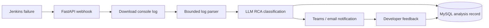

# Jenkins RCA Agent — Executive Summary

## Purpose

The Jenkins RCA Agent analyzes failed Jenkins builds and produces an actionable first-pass root-cause analysis. It reduces manual log investigation by extracting relevant evidence, classifying the failure, recommending a fix, and notifying the responsible engineering audience through Microsoft Teams and email automation.

## Business outcomes

- Faster failure triage and reduced mean time to recovery.
- Consistent separation of infrastructure failures from application-code failures.
- Evidence-backed recommendations instead of unstructured error messages.
- Local/private LLM support through Ollama, with optional OpenRouter integration.
- Feedback capture for measuring accuracy and building a curated evaluation dataset.
- Operational visibility through Prometheus, Grafana, and Langfuse.

## Current solution

## Architecture assessment

The implementation has a clear modular structure: API ingestion, deterministic parsing, LangGraph orchestration, LLM abstraction, persistence, notification, and observability. It is suitable as a proof of concept and controlled pilot.

Before production scale, the highest-priority improvements are:

1. Authenticate and sign Jenkins webhook requests.
2. Restrict log URLs to trusted Jenkins hosts to prevent SSRF.
3. Replace in-process background tasks with a durable queue and workers.
4. Redact sensitive content and define log/model-data retention.
5. Add database migrations, idempotency, notification retries, and readiness checks.
6. Remove environment-specific IP addresses and secrets from deployment files.
7. Govern prompt/model versions and record the version used by each analysis.

## Decision recommendation

Proceed with a controlled pilot for selected Jenkins jobs. Treat model output as decision support, not an automated release or remediation authority. Gate production rollout on security controls, durable execution, observability, and accuracy measurement.

## Success measures

- Webhook acceptance latency.
- Time from failure to delivered RCA.
- RCA completion and notification success rate.
- Infrastructure/application classification accuracy.
- Developer feedback rating and correction rate.
- Percentage of analyses with usable evidence and recommended fixes.
- Reduction in mean time to diagnose failed builds.

See [`PROJECT_DOCUMENTATION.md`](PROJECT_DOCUMENTATION.md) for the complete technical documentation.
