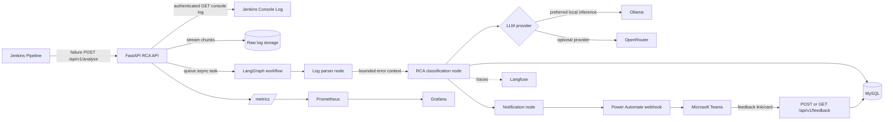
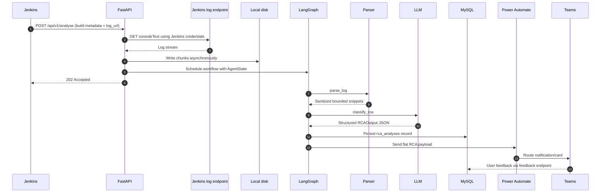
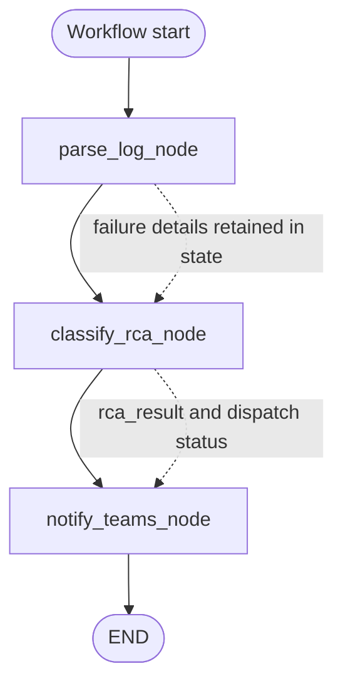
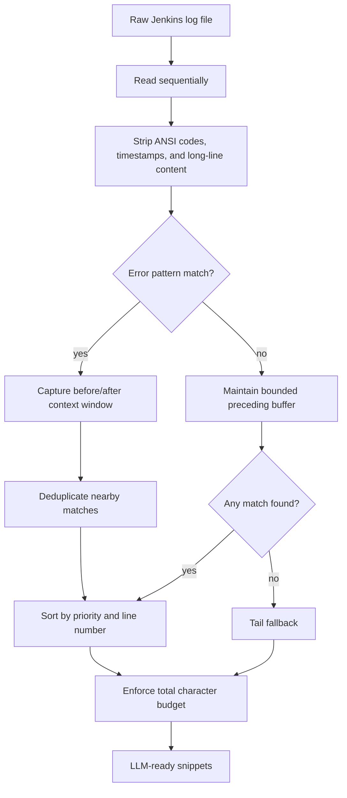
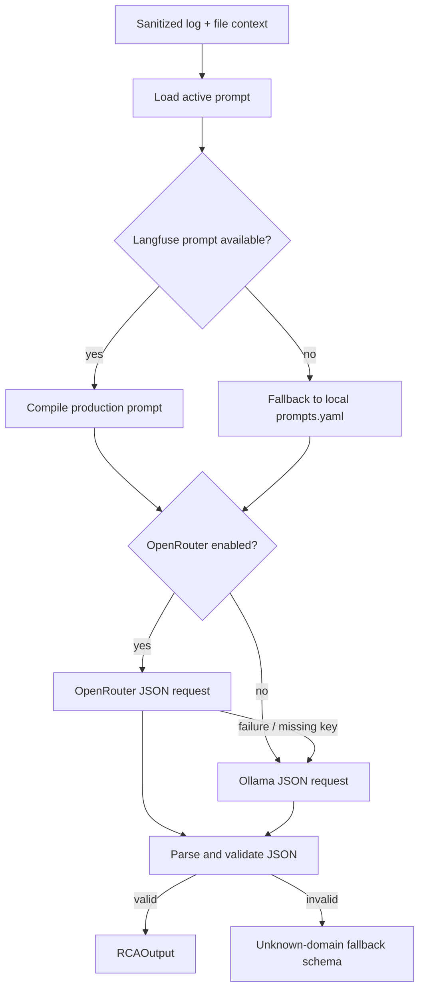
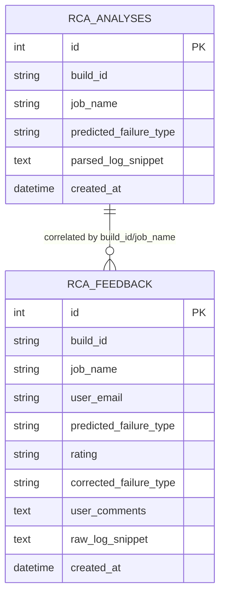
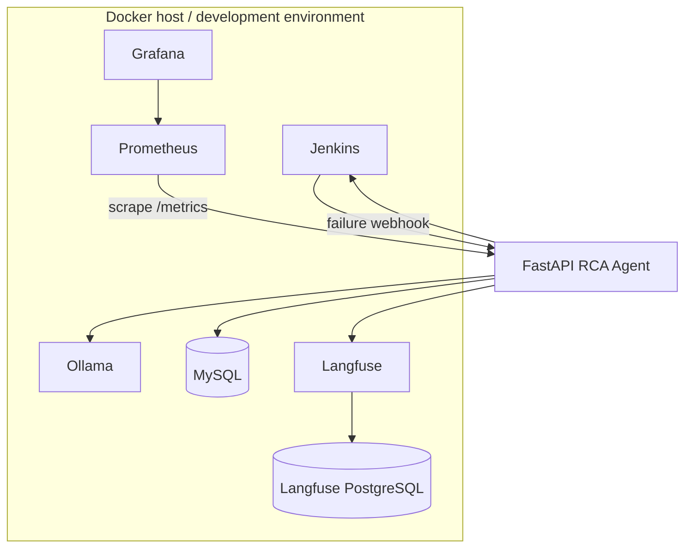
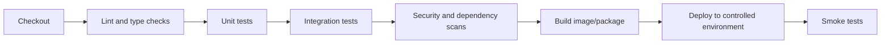

# Jenkins RCA Agent — Architecture and Project Documentation

**Audience:** Senior architects, engineering managers, platform engineers, SREs, and maintainers  
**Repository:** `lyi1cob-ayub/jenkin-learning`  
**Document location:** `agent/`  
**Status:** Describes the implementation currently present in this repository

---

## 1. Executive summary

The Jenkins RCA Agent is an asynchronous root-cause-analysis service for failed Jenkins builds. It receives a failure webhook, retrieves the Jenkins console log, stores the raw log on disk, extracts the most relevant error context, asks an LLM to classify the failure, persists the analysis metadata, and sends a structured notification to Microsoft Teams through Power Automate.

The system is designed to reduce the time engineers spend manually reading large build logs. Its principal output is a structured RCA containing:

- Failure domain: infrastructure, application code, or unknown.
- Root-cause summary.
- Evidence from the build log.
- Affected component.
- Recommended corrective action.
- Confidence score.

The service also exposes a feedback endpoint. Developer feedback is stored in MySQL and can be used to measure classification quality and curate a future golden dataset.

### Business value

- Shortens the feedback loop after a failed CI build.
- Standardizes first-line failure triage.
- Separates infrastructure failures from application failures.
- Provides actionable remediation guidance rather than only reporting that a build failed.
- Captures human feedback for continuous improvement.
- Supports local/private LLM inference through Ollama, with optional OpenRouter fallback.
- Adds operational visibility through Prometheus, Grafana, Langfuse, and structured logging.

---

## 2. Scope and non-goals

### In scope

1. Receiving Jenkins failure events.
2. Fetching and streaming Jenkins console logs.
3. Resource-conscious log parsing and context extraction.
4. LLM-based root-cause classification.
5. Persisting analysis and feedback metadata.
6. Notifying downstream collaboration tooling.
7. Metrics and LLM trace instrumentation.
8. Local development through Docker Compose.

### Current non-goals

- Automatically changing source code or Jenkins configuration.
- Automatically retrying or rerunning a failed build.
- Replacing an engineer's final decision.
- Providing a durable distributed job queue.
- Offering a multi-tenant authorization model.
- Guaranteeing that an LLM result is correct without developer validation.

The agent is therefore a decision-support and triage system, not an autonomous release gate.

---

## 3. High-level architecture



### Architectural style

The implementation combines:

- **API facade:** FastAPI validates incoming requests and exposes health, webhook, and feedback endpoints.
- **Event-driven handoff:** The webhook responds with HTTP `202 Accepted` after downloading the log and scheduling the analysis task.
- **Explicit workflow orchestration:** LangGraph models parsing, classification, and notification as ordered nodes sharing a typed state object.
- **Ports/adapters:** LLM, database, log parsing, and notification integrations are isolated behind focused modules.
- **Human-in-the-loop quality loop:** Feedback is persisted separately from the analysis so predicted and human-confirmed outcomes can be compared.

---

## 4. End-to-end request flow



### Important behavior

1. The webhook downloads the log before returning `202`; very large or inaccessible logs can therefore still delay or fail the webhook request.
2. The actual LangGraph execution is scheduled with `asyncio.create_task` in the API process.
3. A strong-reference set prevents scheduled tasks from being garbage-collected prematurely.
4. The workflow is currently in-process. A process restart loses queued work that has not completed.
5. Raw logs are written under `./tmp/jenkins_raw_logs` and are not automatically deleted by the current implementation.

---

## 5. LangGraph workflow

The workflow is defined in `app/graph/workflow.py` and contains three ordered nodes.



### Shared state

`AgentState` is the contract between nodes. It carries build identity, log location, author/change metadata, parser output, LLM output, notification state, and error state.

| Field group | Examples | Purpose |
|---|---|---|
| Build identity | `build_id`, `job_name` | Correlate all records and notifications |
| Source context | `git_author_email`, `gerrit_change_id` | Identify ownership and provide a change link |
| Log context | `raw_log_path`, `sanitized_log_snippet`, `extracted_error_lines` | Pass bounded evidence to the model |
| RCA result | `rca_result` | Store validated model output |
| Delivery | `assigned_owner_email`, `drafted_notification_body`, `dispatch_status` | Track notification preparation and delivery |
| Failure handling | `error_message` | Preserve node-level failure context |

### Node responsibilities

#### 5.1 `parse_log_node`

- Invokes the LangChain tool `parse_jenkins_log`.
- Extracts the highest-priority snippets.
- Keeps the first three parsed snippets for model context.
- Returns a safe error message in state if the log path is missing or parsing fails.

#### 5.2 `classify_rca_node`

- Sends the sanitized context to the configured LLM client.
- Runs blocking model I/O in a worker thread so the async workflow is not blocked.
- Validates and normalizes the response as `RCAOutput`.
- Persists a compact analysis record in MySQL.

#### 5.3 `notify_teams_node`

- Converts the structured RCA into a flat payload.
- Offloads the synchronous HTTP call to a worker thread.
- Records `DISPATCHED` or `FAILED` in workflow state.
- Does not retry notification delivery in the current implementation.

---

## 6. Log ingestion and parsing design

The parser in `app/tools/logparser.py` is intentionally bounded and streaming-oriented.



### Why this design is used

- **Memory safety:** Logs are read line-by-line rather than loaded entirely into RAM.
- **Token control:** `LOG_PARSER_MAX_TOTAL_CHARS` bounds model input.
- **Noise reduction:** ANSI escape sequences and timestamps are removed.
- **Signal prioritization:** Explicit exception strings and critical patterns rank above secondary build messages.
- **Context preservation:** A bounded window around each match provides enough evidence for diagnosis.
- **Fallback behavior:** If no known pattern matches, the tail of the log is still provided for analysis.

### Configurable limits

| Setting | Current example | Rationale |
|---|---:|---|
| `LOG_PARSER_MAX_CONTEXT_LINES` | 40 | Context around matched lines |
| `LOG_PARSER_MAX_TOTAL_CHARS` | 24000 | LLM input/token budget protection |
| `LOG_PARSER_MAX_LINE_LENGTH` | 2000 | Prevent pathological individual lines |

The parser is not a security sandbox: raw log contents still need a retention and sensitive-data policy before production use.

---

## 7. LLM strategy and model contract

The LLM client supports two execution paths:

1. **Ollama:** Preferred local/private inference path.
2. **OpenRouter:** Optional external provider path when `USE_OPENROUTER=True`.



### Structured output contract

`RCAOutput` requires:

- `domain`: `Infrastructure`, `Application Code`, or `Unknown`.
- `root_cause`: Explanation of why the build failed.
- `evidence`: Supporting log line or snippet.
- `affected_component`: Tool, binary, service, or source component.
- `recommended_fix`: Actionable remediation.
- `confidence`: Number from `0.0` to `1.0`.

The model response is cleaned of optional `<think>` blocks, JSON is extracted, and Pydantic validation is applied. If parsing fails, the client returns a valid fallback object with confidence `0.0` rather than crashing the workflow.

### Reliability measures

- OpenRouter calls retry on timeouts, rate limits, and server errors.
- OpenRouter failures fall back to Ollama.
- Ollama request failures produce a safe fallback RCA schema.
- Prompt versions are configured rather than hard-coded in the workflow.
- Langfuse traces can capture prompt, model, and usage data when configured.

### Architectural consideration

The current client fetches the Langfuse prompt named `v5_qwen3_14b` while the local settings include an `ACTIVE_PROMPT_VERSION` value. These are separate controls and should be unified or explicitly documented before production rollout to avoid prompt-version drift.

---

## 8. Data architecture

MySQL stores two principal entities.



### Data lifecycle

- `RCAAnalysisModel` is written after model classification.
- The feedback endpoint retrieves the latest analysis for a build/job pair.
- Feedback is deduplicated by build, job, and user email.
- Feedback can include a rating, corrected type, comments, and captured snippet.
- The current schema uses `create_all`; it does not provide migration/version management.

### Recommended production controls

- Add Alembic migrations and schema ownership.
- Add a uniqueness constraint matching the feedback de-duplication rule.
- Encrypt or redact sensitive log content.
- Define retention and deletion policies for raw logs and snippets.
- Add indexes for the most common reporting queries.
- Store a correlation/request ID with every analysis and notification.

---

## 9. Integration contracts

### Jenkins → RCA API

`POST /api/v1/analyse`

```json
{
  "build_id": "123",
  "job_name": "sample-job",
  "log_url": "http://jenkins/job/sample-job/123/consoleText",
  "git_author_email": "developer@example.com",
  "gerrit_change_id": "https://review.example/change/123"
}
```

Response: HTTP `202 Accepted` after log retrieval and task scheduling.

### RCA → Power Automate

The notification tool sends a flat JSON payload suitable for the Power Automate Parse JSON action:

```json
{
  "failure_type": "INFRASTRUCTURE",
  "root_cause": "...",
  "recommended_fix": "...",
  "author_email": "developer@example.com",
  "author_name": "developer",
  "change_url": "...",
  "job_name": "sample-job",
  "build_number": "123"
}
```

The referenced flow branches on `failure_type`. The infrastructure path posts a Teams message, lists team members, filters recipients, and sends email; the other path posts to Teams and sends an email. The flow is an external dependency and is not versioned in this repository, so its schema and ownership should be managed alongside the application contract.

### Feedback API

`GET` supports email/browser links and renders confirmation HTML. `POST` supports Teams or API clients and returns JSON. Required business fields are `build_id`, `job_name`, and `rating`.

### Health and metrics

- `GET /health` returns `{ "status": "healthy" }`.
- `GET /metrics` is exposed by `prometheus-fastapi-instrumentator`.

The current health endpoint is process-level only; it does not verify MySQL, Ollama, Jenkins reachability, or notification availability.

---

## 10. Deployment topology

The Compose file provides the supporting stack:

| Service | Responsibility | Default port |
|---|---|---:|
| `jenkins` | Build orchestration and source pipeline | 8080, 50000 |
| `ollama` | Local LLM inference | 11434 |
| `mysql` | RCA and feedback persistence | 3306 |
| `prometheus` | Metrics collection | 9090 |
| `grafana` | Dashboards | 3000 |
| `langfuse_db` | Langfuse PostgreSQL storage | internal |
| `langfuse` | LLM prompt/trace UI | 3001 |

The FastAPI agent itself is run separately by `uvicorn` in the current Compose file; `docker-compose.yaml` provides its dependencies but does not define an `agent` service.



### Configuration

Configuration is loaded from `agent/.env` using Pydantic settings. `env.example` documents application, database, Ollama, OpenRouter, Jenkins, Teams, parser, and Langfuse variables.

Never commit real credentials, API keys, proxy credentials, database passwords, or webhook URLs. The sample Compose file currently contains development placeholder secrets and environment-specific network addresses; these must be externalized for shared or production environments.

---

## 11. Operations runbook

### Start supporting services

```bash
cd agent
docker compose up -d
```

Pull or prepare the configured Ollama model, create `agent/.env` from `env.example`, install Python dependencies, and start the API:

```bash
cd agent
python -m venv .venv
source .venv/bin/activate
pip install -r requirements.txt
uvicorn main:app --host 0.0.0.0 --port 8000
```

### Basic verification

```bash
curl http://localhost:8000/health
curl http://localhost:8000/metrics
```

Expected health response:

```json
{"status":"healthy"}
```

### Troubleshooting checklist

| Symptom | First checks |
|---|---|
| Webhook returns 4xx | Validate Pydantic fields, `log_url`, Jenkins access, and Jenkins credentials |
| Webhook cannot fetch log | Check network route, URL, credentials, redirects, and Jenkins authorization |
| RCA is `Unknown` | Inspect parser output, model availability, prompt version, and LLM response logs |
| No Teams notification | Verify `TEAMS_WEBHOOK_URL`, Power Automate response status, and payload schema |
| Feedback fails | Verify MySQL connectivity, schema creation, required fields, and duplicate user/build combination |
| No Prometheus data | Verify `/metrics`, target address in `prometheus.yml`, and network reachability |
| Langfuse has no traces | Check public/secret keys, host, version compatibility, and shutdown flushing |
| Work disappears after restart | Expected with in-process `asyncio.create_task`; use a durable queue for production |

### Observability signals

- Application logs: Loguru messages for webhook, parser, model, database, and notification stages.
- Metrics: FastAPI request metrics under `/metrics`.
- Traces: Langfuse observations around RCA analysis and model generation.
- Business records: MySQL analysis and feedback tables.

Recommended dashboard metrics include webhook volume, accepted-to-completed latency, parser failures, model fallback count, RCA confidence distribution, notification success rate, feedback rating, and classification accuracy by failure domain.

---

## 12. Security, privacy, and resilience assessment

### Current strengths

- Jenkins credentials are configuration-driven rather than embedded in request code.
- Pydantic validates request and model structures.
- The parser bounds line and total context sizes.
- The LLM output is validated before notification.
- Feedback email values are checked against an email pattern.
- Database sessions are closed through dependency/finally handling.

### Risks requiring remediation

1. **Webhook authentication:** The `/analyse` endpoint does not show HMAC/signature validation or an API token. Add authenticated ingress and request replay protection.
2. **SSRF risk:** `log_url` is supplied by the caller and fetched by the agent. Restrict allowed hosts, schemes, ports, and redirects to trusted Jenkins endpoints.
3. **Sensitive log exposure:** Logs may contain credentials, tokens, personal data, or source code. Redact before persistence and before sending to external LLM providers.
4. **Hard-coded infrastructure values:** Compose and Jenkins examples contain internal IP addresses and development secrets/placeholders. Move them to secret management and deployment configuration.
5. **In-process background work:** Tasks are not durable and are not horizontally coordinated. Use a queue/worker model for production scale.
6. **Raw log retention:** Implement TTL cleanup, object storage lifecycle policies, or encrypted storage.
7. **Notification retries:** Add bounded retries, idempotency keys, and a dead-letter path.
8. **Health semantics:** Add dependency-aware readiness checks separate from the liveness endpoint.
9. **Database migrations:** Replace `create_all` with controlled migrations.
10. **Authorization for feedback:** Protect administrative/reporting access and validate allowed rating values (`UP`/`DOWN`).
11. **Prompt/model governance:** Version prompts and models together, record the version used per analysis, and evaluate changes before promotion.
12. **Dependency supply chain:** Pin all transitive dependencies and scan images/packages.

---

## 13. Testing and delivery maturity

The repository includes `agent/app/test_app.py`, which intentionally exercises a chained exception scenario. The active Jenkinsfile currently focuses on simulating an infrastructure failure by invoking a missing CLI and then calling the RCA webhook from the `post { failure }` block.

Recommended CI stages:



Recommended test coverage:

- Webhook schema and authorization tests.
- Jenkins log download tests with timeout and non-200 responses.
- Parser tests for ANSI logs, timestamps, large lines, duplicate errors, no-match fallback, and character limits.
- LLM tests for valid JSON, fenced JSON, thinking blocks, invalid JSON, list-to-string coercion, retry, and provider fallback.
- Database tests for persistence, rollback, and feedback de-duplication.
- Notification tests for payload schema, missing webhook, non-2xx responses, and retries.
- End-to-end test from webhook through notification using mocked external services.

---

## 14. Repository map

```text
agent/
├── Jenkinsfile                 # Failure simulation and RCA webhook trigger
├── docker-compose.yaml         # Jenkins, Ollama, MySQL, observability stack
├── env.example                 # Configuration template
├── main.py                     # FastAPI application, startup, health, metrics
├── prometheus.yml              # Prometheus scrape configuration
├── requirements.txt            # Python dependencies
├── workflow_graph.png          # Generated LangGraph visualization
└── app/
    ├── api/webhook.py          # Analyse and feedback HTTP endpoints
    ├── config.py               # Pydantic settings and environment loading
    ├── db/db.py                # SQLAlchemy engine/session/database init
    ├── graph/
    │   ├── state.py            # Shared AgentState contract
    │   ├── workflow.py         # LangGraph topology
    │   └── nodes/              # Parse, classify, and notify nodes
    ├── llm/client.py           # Ollama/OpenRouter/prompt/trace integration
    ├── models/                 # Pydantic and SQLAlchemy domain models
    ├── prompts/prompts.yaml    # Local prompt registry
    ├── tools/logparser.py      # Bounded Jenkins log parsing tool
    ├── tools/notifications.py  # Power Automate/Teams adapter
    ├── utils/visualizaton.py   # LangGraph Mermaid/PNG rendering
    └── test_app.py             # Failure-chain test scenario
```

---

## 15. Decisions and rationale

| Decision | Rationale |
|---|---|
| FastAPI | Lightweight typed API with async support and automatic OpenAPI documentation |
| LangGraph | Makes the RCA stages explicit, inspectable, and extensible |
| Streaming log download | Avoids holding an entire Jenkins log in memory |
| Bounded parser context | Controls LLM cost, latency, and context-window risk |
| Pydantic RCA schema | Prevents malformed model output from reaching downstream systems |
| Ollama first | Enables private/local inference and reduces external data exposure |
| OpenRouter option | Provides provider flexibility and fallback capability |
| MySQL | Durable storage for analysis and feedback records |
| Power Automate | Reuses enterprise Teams/email routing and approval capabilities |
| Prometheus/Grafana | Standard metrics collection and operational dashboards |
| Langfuse | Prompt, generation, and usage observability |
| Feedback table | Enables quality measurement and future supervised improvement |

---

## 16. Recommended target state

For production readiness, prioritize the following in order:

1. Protect the webhook with authenticated, signed requests and restrict `log_url` to trusted Jenkins hosts.
2. Remove secrets and environment-specific addresses from Compose/Jenkins configuration.
3. Add redaction, encryption, and retention controls for logs and model prompts.
4. Replace in-process background tasks with a durable queue and worker deployment.
5. Add idempotency using a build/job correlation key so duplicate Jenkins events are safe.
6. Add dependency-aware readiness probes and alerting.
7. Add database migrations and enforce feedback constraints at the database layer.
8. Add notification retry/dead-letter handling.
9. Standardize prompt/model version recording and evaluation.
10. Establish service-level objectives, for example webhook acceptance latency, RCA completion latency, notification success rate, and classification accuracy.
11. Add automated unit, integration, security, and end-to-end tests to the Jenkins pipeline.
12. Package the agent as a first-class container/service in the deployment topology.

---

## 17. Executive conclusion

The current implementation is a strong proof of concept for an AI-assisted Jenkins failure triage capability. It demonstrates a clear separation between ingestion, deterministic log reduction, probabilistic RCA, persistence, notification, and feedback. The most important architectural gap before production adoption is operational durability: the analysis task, raw-log lifecycle, external integrations, and security boundaries need stronger guarantees than an in-process development service provides.

With authenticated ingestion, sensitive-data controls, durable asynchronous execution, governed model/prompt releases, and production-grade observability, this design can evolve into a reusable CI failure-analysis platform rather than a one-off Jenkins integration.
