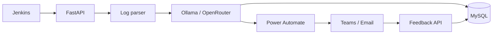
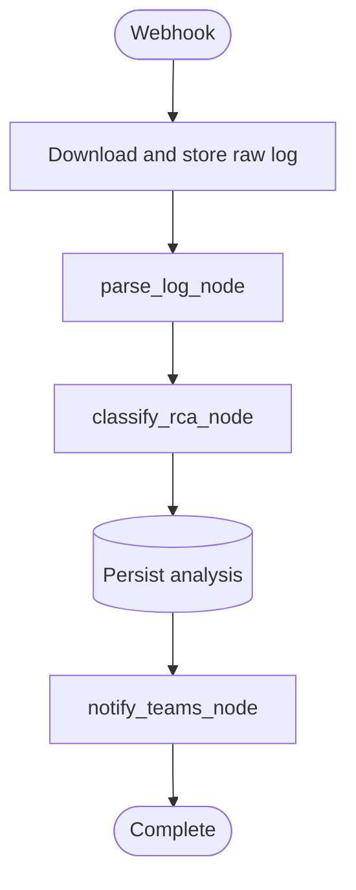

# Jenkins RCA Agent

The Jenkins RCA Agent provides automated first-pass root-cause analysis for failed Jenkins builds.

It downloads the failed build log, extracts the most relevant error context, uses a configured LLM to classify the failure, persists the result, and notifies developers through Microsoft Teams and email automation.

## What it does



### Main capabilities

- Jenkins failure webhook ingestion.
- Chunked console-log retrieval.
- Bounded streaming parser with error prioritization.
- LangGraph workflow orchestration.
- Structured RCA output with confidence and evidence.
- Ollama local inference and optional OpenRouter integration.
- MySQL analysis and developer-feedback persistence.
- Power Automate/Teams notification integration.
- Prometheus metrics, Grafana dashboards, and Langfuse traces.

## Quick start

### 1. Configure environment

```bash
cd agent
cp env.example .env
# Edit .env with approved development values
```

Do not commit `.env`, credentials, API keys, webhook URLs, or production network values.

### 2. Start dependencies

```bash
docker compose up -d
```

The Compose stack includes Jenkins, Ollama, MySQL, Prometheus, Grafana, and Langfuse services.

### 3. Install and run the API

```bash
python -m venv .venv
source .venv/bin/activate
pip install -r requirements.txt
uvicorn main:app --host 0.0.0.0 --port 8000
```

### 4. Verify the service

```bash
curl http://localhost:8000/health
curl http://localhost:8000/metrics
```

## API endpoints

| Method | Endpoint | Purpose |
|---|---|---|
| `GET` | `/health` | Process health check |
| `GET` | `/metrics` | Prometheus metrics |
| `POST` | `/api/v1/analyse` | Receive Jenkins failure and queue RCA |
| `GET` | `/api/v1/feedback` | Record feedback from browser/email links |
| `POST` | `/api/v1/feedback` | Record feedback from Teams/API clients |

Example analysis request:

```bash
curl -X POST http://localhost:8000/api/v1/analyse \
  -H 'Content-Type: application/json' \
  -d '{
    "build_id": "123",
    "job_name": "sample-job",
    "log_url": "http://jenkins:8080/job/sample-job/123/consoleText",
    "git_author_email": "developer@example.com"
  }'
```

The endpoint returns `202 Accepted` after the log is downloaded and the in-process workflow task is scheduled.

## Workflow



The current workflow is:

`parse_log → classify_rca → notify_teams → END`

## Repository structure

```text
agent/
├── main.py
├── Jenkinsfile
├── docker-compose.yaml
├── env.example
├── prometheus.yml
├── requirements.txt
├── PROJECT_DOCUMENTATION.md
├── EXECUTIVE_SUMMARY.md
├── ARCHITECTURE_PRESENTATION.md
└── app/
    ├── api/webhook.py
    ├── config.py
    ├── db/db.py
    ├── graph/
    ├── llm/client.py
    ├── models/
    ├── prompts/prompts.yaml
    ├── tools/logparser.py
    ├── tools/notifications.py
    └── utils/visualizaton.py
```

## Configuration highlights

- `DATABASE_URL`: MySQL SQLAlchemy connection string.
- `OLLAMA_HOST`, `OLLAMA_MODEL`: local inference configuration.
- `USE_OPENROUTER`, `OPENROUTER_API_KEY`, `OPENROUTER_MODEL`: optional external provider configuration.
- `ACTIVE_PROMPT_VERSION`: local prompt registry selection.
- `JENKINS_USER`, `JENKINS_TOKEN`: Jenkins log retrieval credentials.
- `TEAMS_WEBHOOK_URL`: Power Automate webhook.
- `LOG_PARSER_MAX_CONTEXT_LINES`, `LOG_PARSER_MAX_TOTAL_CHARS`, `LOG_PARSER_MAX_LINE_LENGTH`: parser limits.
- `LANGFUSE_PUBLIC_KEY`, `LANGFUSE_SECRET_KEY`, `LANGFUSE_HOST`: LLM observability.

## Important operational limitations

This repository currently represents a proof of concept / controlled-pilot implementation:

- Background work uses in-process `asyncio.create_task`; a restart can lose queued work.
- Caller-provided `log_url` needs allowlisting and SSRF protection.
- Raw logs are stored locally and require retention, encryption, and redaction controls.
- The health endpoint checks process availability, not dependency readiness.
- The current database setup uses `create_all`, not versioned migrations.
- Notification delivery does not yet have durable retries or a dead-letter path.
- Deployment files include environment-specific values that must be externalized.

Read [`PROJECT_DOCUMENTATION.md`](PROJECT_DOCUMENTATION.md) before deploying beyond a controlled environment.

## Development and testing

The Jenkinsfile currently simulates an infrastructure failure and invokes the RCA webhook from the failure handler. The repository also contains a deliberately failing exception-chain test scenario in `app/test_app.py`.

Recommended checks before merge:

```bash
pytest -q
python -m compileall app main.py
```

For production maturity, add parser unit tests, API contract tests, provider-mock tests, database integration tests, notification tests, security scans, and an end-to-end test.

## Documentation index

- [`PROJECT_DOCUMENTATION.md`](PROJECT_DOCUMENTATION.md) — complete architecture, operations, security, and implementation documentation.
- [`EXECUTIVE_SUMMARY.md`](EXECUTIVE_SUMMARY.md) — manager and architecture decision summary.
- [`ARCHITECTURE_PRESENTATION.md`](ARCHITECTURE_PRESENTATION.md) — slide-ready presentation outline.
