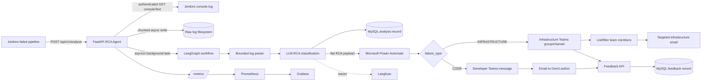
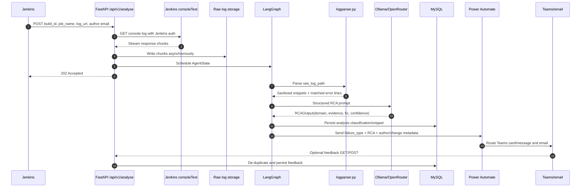
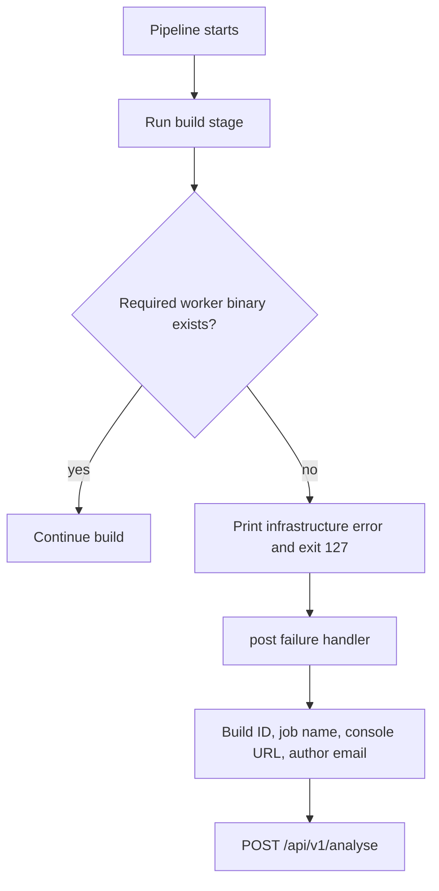
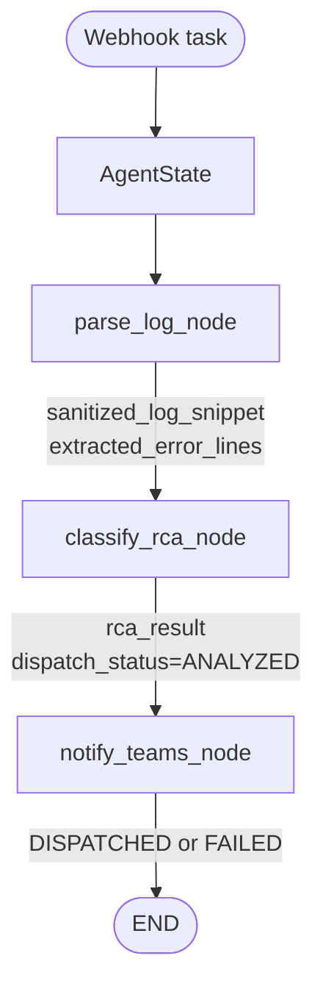
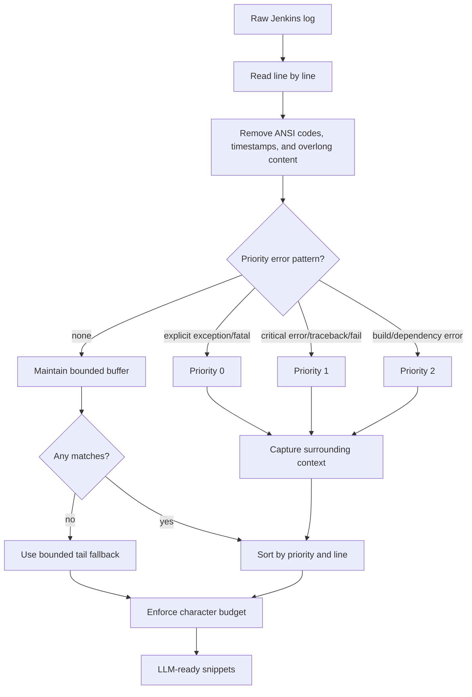
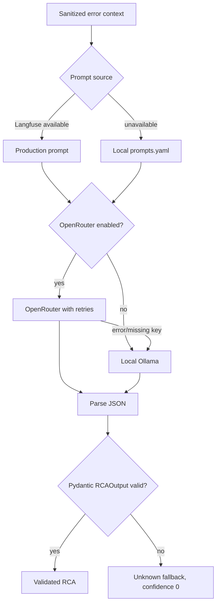
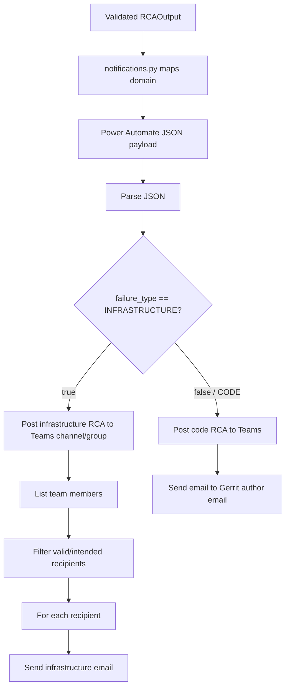
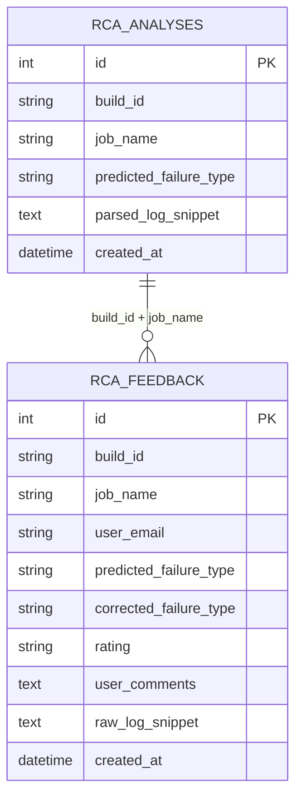
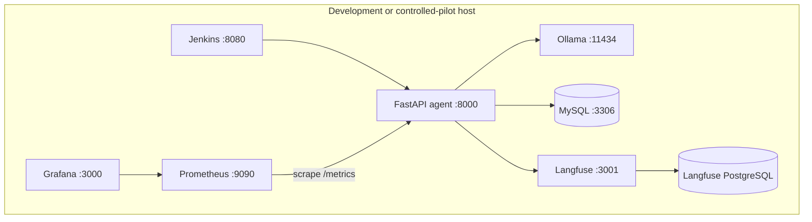
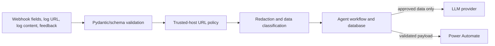

# Jenkins Failure RCA Agent
## Senior Architecture and Management Documentation

**Repository:** `lyi1cob-ayub/jenkin-learning`  
**Implementation location:** `agent/`  
**Audience:** Senior architects, engineering managers, platform engineering, SRE, and service maintainers  
**Document status:** Current-state architecture with production-readiness recommendations

> This document describes the implementation in this repository and the intended Microsoft Power Automate routing shown in the associated workflow design. The agent is a decision-support system: it recommends a root cause and remediation; it does not automatically change source code, infrastructure, or Jenkins configuration.

---

## 1. Executive decision summary

The Jenkins Failure RCA Agent automates the first-pass investigation of failed CI builds. When a Jenkins pipeline fails, Jenkins sends build metadata and a console-log URL to the FastAPI service. The service downloads the log, stores it locally, and starts a LangGraph workflow that extracts high-value error context, asks a configured LLM to classify the failure, persists the result, and sends a normalized event to Microsoft Power Automate.

Power Automate is the enterprise routing layer. It branches on `failure_type`:

- **Infrastructure failure:** post the RCA to the infrastructure Teams channel/group, obtain the relevant team members, filter recipients, and send targeted email notifications.
- **Application/code failure:** post the RCA to Teams and send an email to the Gerrit change author/developer email supplied by Jenkins.

The recommended management decision is to approve a controlled pilot for selected jobs while making webhook authentication, SSRF protection, sensitive-log handling, durable background processing, retries, and secret management release gates for production.

### Business outcomes

- Reduce time spent searching large Jenkins console logs.
- Standardize first-line triage and distinguish infrastructure failures from application-code failures.
- Provide evidence and a recommended fix instead of a generic “build failed” alert.
- Route ownership to the right engineering audience.
- Capture developer feedback for measuring classification quality and improving prompts/models.

---

## 2. Problem and solution

### Problem

A failed build usually produces a long, noisy console log. The meaningful error may be separated from setup output, timestamps, ANSI formatting, dependency messages, or secondary failures. Engineers must manually determine whether the failure belongs to the worker/platform or to the change under review, then notify the correct people.

### Solution

The agent inserts an automated, evidence-preserving triage stage after a failed Jenkins build:

1. Receive a failure webhook.
2. Retrieve the console log using configured Jenkins credentials.
3. Stream the log to disk without loading the full file into memory.
4. Parse and prioritize error evidence with deterministic rules.
5. Ask the LLM for a validated structured RCA.
6. Persist the analysis and classification.
7. Send one normalized notification payload to Power Automate.
8. Route Teams/email notifications according to the failure domain.
9. Accept human feedback through email links or Teams/API requests.

---

## 3. Current-state architecture



### Architectural style

- **API facade:** FastAPI validates the Jenkins and feedback contracts.
- **Event-driven handoff:** The API downloads the log, schedules analysis, and returns `202 Accepted`.
- **Explicit orchestration:** LangGraph models `parse_log → classify_rca → notify_teams → END`.
- **Deterministic + probabilistic split:** Regex/rule-based parsing reduces the log before the LLM makes a classification.
- **Enterprise integration boundary:** Power Automate owns Teams/email recipient logic; the Python service sends a stable payload.
- **Human-in-the-loop quality loop:** Feedback is stored separately and correlated with the analysis.

---

## 4. End-to-end runtime sequence



### Important current behavior

- `POST /api/v1/analyse` downloads the log **before** returning `202`; a slow or unreachable Jenkins endpoint can therefore delay the response.
- The workflow runs in the API process through `asyncio.create_task`. A process restart can lose work that has not completed.
- Raw logs are written under `./tmp/jenkins_raw_logs` and are not automatically deleted by the current code.
- Notification retry and dead-letter handling are not currently implemented.
- The current `/health` endpoint verifies process availability only, not dependency readiness.

---

## 5. Jenkins failure trigger

The current `agent/Jenkinsfile` deliberately simulates an infrastructure failure by attempting to execute `non_existent_cli_tool`. The command exits with code `127`, the `post { failure { ... } }` handler runs, and Jenkins sends a JSON request to the agent.



The production pipeline should replace hard-coded endpoints and developer identities with Jenkins credentials, environment configuration, and a secure service URL.

---

## 6. LangGraph workflow and shared state



`AgentState` is the contract shared by all nodes. It carries:

| State area | Fields | Purpose |
|---|---|---|
| Build identity | `build_id`, `job_name` | Correlation across log, RCA, database, and notification |
| Ownership | `git_author_email`, `gerrit_change_id` | Developer routing and change reference |
| Log evidence | `raw_log_path`, `sanitized_log_snippet`, `extracted_error_lines` | Bounded evidence for analysis |
| RCA | `rca_result` | Validated model output |
| Delivery | `assigned_owner_email`, `drafted_notification_body`, `dispatch_status` | Notification lifecycle |
| Failure handling | `error_message` | Node-level diagnostic information |

### Node responsibilities

1. **`parse_log_node`** invokes `parse_jenkins_log_tool`, selects the highest-priority snippets, and writes parsing failures into state rather than crashing the complete request.
2. **`classify_rca_node`** executes model I/O in a worker thread, validates the response as `RCAOutput`, and persists the analysis classification in MySQL.
3. **`notify_teams_node`** converts the model result to a flat payload and calls the Power Automate adapter. It records `DISPATCHED` or `FAILED`.

---

## 7. Log parsing design

The parser is intentionally deterministic and bounded before any LLM call.



Why this approach is used:

- **Memory safety:** sequential reading avoids loading the full log into RAM.
- **Signal quality:** explicit exceptions and fatal errors rank above generic build failures.
- **Cost and latency control:** `LOG_PARSER_MAX_TOTAL_CHARS` limits model input.
- **Context preservation:** lines around a match help explain the failure.
- **Fallback coverage:** the log tail is still analyzed when no known pattern matches.

Configured limits include 40 context lines, 24,000 total characters, and 2,000 characters per line in the supplied configuration.

---

## 8. LLM strategy and RCA contract



`RCAOutput` requires:

- `domain`: Infrastructure, Application Code, or Unknown.
- `root_cause`: why the build failed.
- `evidence`: supporting log line or snippet.
- `affected_component`: failed tool, binary, service, or code component.
- `recommended_fix`: actionable remediation.
- `confidence`: value from `0.0` to `1.0`.

Ollama is the preferred private/local inference option. OpenRouter is optional and provides provider flexibility. The client retries selected OpenRouter failures, falls back to Ollama, strips optional thinking blocks, extracts JSON, validates it, and returns a safe fallback schema when parsing fails.

---

## 9. Power Automate and notification routing

The Python notification adapter sends a flat JSON object to `TEAMS_WEBHOOK_URL`. The service does not select individual Teams members; that responsibility belongs to the Power Automate flow.



Payload fields currently include:

```json
{
  "failure_type": "INFRASTRUCTURE|CODE",
  "root_cause": "...",
  "recommended_fix": "...",
  "author_email": "developer@example.com",
  "author_name": "developer",
  "change_url": "...",
  "job_name": "sample-job",
  "build_number": "123"
}
```

The routing design separates concerns: the agent performs analysis and emits a stable contract; Power Automate applies enterprise recipient and communication policy. The flow should validate the payload, avoid duplicate sends, and record delivery failures.

---

## 10. Data and feedback architecture



Feedback can arrive through a browser/email GET link or a Teams/API POST. The endpoint validates the user email format, checks for an existing feedback record for the same build/job/user, retrieves the latest analysis, and persists the feedback.

Production controls required before storing real console logs include redaction, encryption, retention/deletion policy, access control, database indexes, and a uniqueness constraint matching the application de-duplication rule.

---

## 11. Deployment and observability

The supplied Docker Compose stack provides Jenkins, Ollama, MySQL, Prometheus, Grafana, and Langfuse with PostgreSQL. The FastAPI agent is currently started separately with Uvicorn.



Operational signals:

- Loguru application logs for ingestion, parsing, LLM, persistence, and notification stages.
- FastAPI metrics at `/metrics`.
- Prometheus collection and Grafana dashboards.
- Langfuse traces for prompt/model behavior when configured.
- MySQL analysis and feedback records.

Recommended alerts: webhook error rate, RCA completion latency, LLM fallback rate, notification failure rate, database connectivity, stale Prometheus target, and low-confidence classification rate.

---

## 12. Security, privacy, and resilience assessment

### Strengths already present

- Pydantic validation for webhook and RCA structures.
- Jenkins credentials are configuration-driven.
- Parser limits individual lines and total model context.
- LLM output is validated before notification.
- Email values used by feedback are format-checked.
- Local Ollama supports private inference.

### Release-blocking gaps

1. **Webhook authentication:** add a signed webhook or API token and replay protection.
2. **SSRF protection:** allow only approved Jenkins schemes, hosts, ports, and redirects for `log_url`.
3. **Sensitive-data protection:** redact credentials, tokens, personal data, and proprietary content before persistence or external inference.
4. **Secrets management:** remove passwords, proxy details, internal IPs, and webhook values from deployment files; use a secret manager.
5. **Durability:** replace in-process tasks with a durable queue and worker deployment.
6. **Idempotency:** correlate and de-duplicate repeated Jenkins events by job/build identity.
7. **Notification reliability:** add bounded retries, idempotency keys, and a dead-letter path.
8. **Storage lifecycle:** encrypt raw logs and implement TTL cleanup or managed object-storage lifecycle rules.
9. **Dependency readiness:** add dependency-aware readiness checks separate from liveness.
10. **Prompt/model governance:** record prompt and model versions with every RCA and evaluate changes against a golden dataset.

### Trust-boundary view



---

## 13. Current-state versus target-state comparison

| Capability | Current implementation | Target production state |
|---|---|---|
| Work execution | In-process `asyncio.create_task` | Durable queue and scalable workers |
| Ingress | FastAPI endpoint without visible signature validation | Authenticated, signed, replay-safe gateway |
| Log URL | Caller-provided URL | Jenkins host/scheme allowlist and redirect policy |
| Log storage | Local filesystem | Encrypted managed storage with TTL |
| Database schema | SQLAlchemy `create_all` | Versioned migrations and constraints |
| Notification | One HTTP attempt | Retry, idempotency, dead-letter handling |
| Health | Process-level `/health` | Liveness plus dependency-aware readiness |
| Configuration | `.env` and environment-specific examples | Central secret/config management |
| Testing | Limited scenario test | Unit, contract, integration, security, and E2E gates |
| AI governance | Prompt registry/Langfuse support | Versioned model/prompt releases and evaluation gates |

---

## 14. Operations and developer quick start

```bash
cd agent
cp env.example .env
# Set approved development values; never commit .env

docker compose up -d
python -m venv .venv
source .venv/bin/activate
pip install -r requirements.txt
uvicorn main:app --host 0.0.0.0 --port 8000
```

Verify the service:

```bash
curl http://localhost:8000/health
curl http://localhost:8000/metrics
```

Useful checks:

```bash
pytest -q
python -m compileall app main.py
```

### Troubleshooting

| Symptom | First checks |
|---|---|
| Webhook 4xx/5xx | Payload fields, Jenkins URL, credentials, network route, and response logs |
| No RCA | Raw log path, parser output, Ollama availability, prompt version, and model response |
| `Unknown` RCA | LLM JSON/schema validation, provider fallback, and confidence value |
| No Teams/email | `TEAMS_WEBHOOK_URL`, Power Automate run history, payload schema, and recipient filtering |
| Feedback failure | MySQL connectivity, required fields, email value, and duplicate record |
| Missing metrics | `/metrics`, Prometheus target address, and network reachability |
| Work lost after restart | Expected current limitation; use a durable queue for production |

---

## 15. Recommended delivery roadmap

### Phase 1 — Controlled pilot

- Select low-risk Jenkins jobs.
- Run in advisory/shadow mode.
- Measure classification accuracy, latency, notification delivery, and feedback rate.
- Require human review for low-confidence or unknown results.

### Phase 2 — Production hardening

- Implement authentication, SSRF controls, redaction, secret management, durable work execution, migrations, idempotency, retries, and readiness checks.
- Establish ownership, dashboards, alerts, runbooks, and SLOs.

### Phase 3 — Platform capability

- Expand to additional job families.
- Add domain-specific parsing and routing policies.
- Use reviewed feedback as an evaluation/golden dataset.
- Consider only narrow, reversible automated remediation with explicit approval controls.

### Success measures

- Webhook acceptance latency.
- Failure-to-RCA completion latency.
- Notification success rate.
- Infrastructure/application classification accuracy.
- Human correction and feedback rate.
- Percentage of RCAs with usable evidence and recommended fixes.
- Reduction in mean time to diagnose failed builds.

---

## 16. Source map

| Concern | Repository location |
|---|---|
| FastAPI startup, health, metrics | `agent/main.py` |
| Jenkins webhook and feedback API | `agent/app/api/webhook.py` |
| LangGraph topology and state | `agent/app/graph/` |
| LLM providers and validation | `agent/app/llm/client.py` |
| Log parsing | `agent/app/tools/logparser.py` |
| Power Automate payload adapter | `agent/app/tools/notifications.py` |
| Pydantic and persistence models | `agent/app/models/` |
| Prompt registry | `agent/app/prompts/prompts.yaml` |
| Jenkins failure trigger | `agent/Jenkinsfile` |
| Supporting services | `agent/docker-compose.yaml` |
| Metrics scrape configuration | `agent/prometheus.yml` |
| Environment template | `agent/env.example` |

## Conclusion

The repository demonstrates a clear proof of concept for AI-assisted Jenkins failure triage. Its strongest architectural decision is the separation between deterministic evidence extraction, structured LLM classification, and enterprise notification routing. The next architectural step is not additional model complexity; it is production hardening around trust boundaries, data handling, durable execution, delivery reliability, and measurable AI quality.
